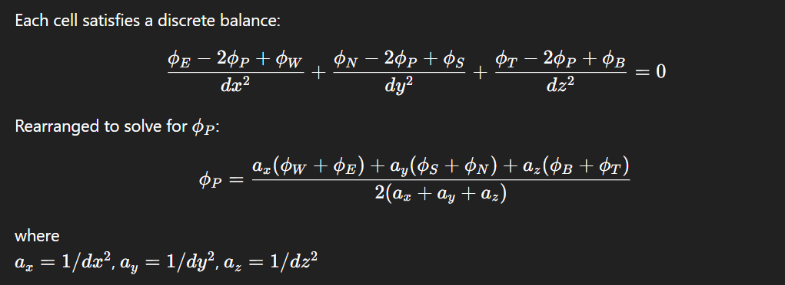

# Fundamental problem in CFD

Given a fluid, how does it move and evolve in space and time? That means you want:
- velocity everywhere
- pressure everywhere
- maybe temperature, concentration

## Partial Differential Equation (PDE)

PDE makes your system obeys physics:

- Conservation of mass
- Conservation of momentum
- Conservation of energy

It gives you relationships between neighboring points.

Given a scalar field ϕ (temperature, concentration, electric potential) in a box where:

- Left face (xmin): ϕ=1
- Right face (xmax): ϕ=0
- Other faces: no flux (insulated walls)

The PDE being solved in this current CFD is:

∇^2ϕ=0

This is the Laplace equation.
